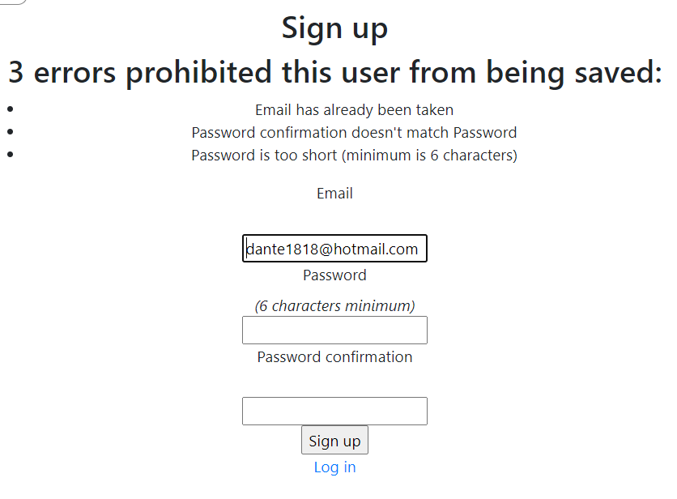
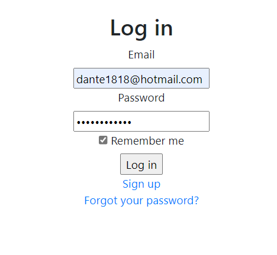
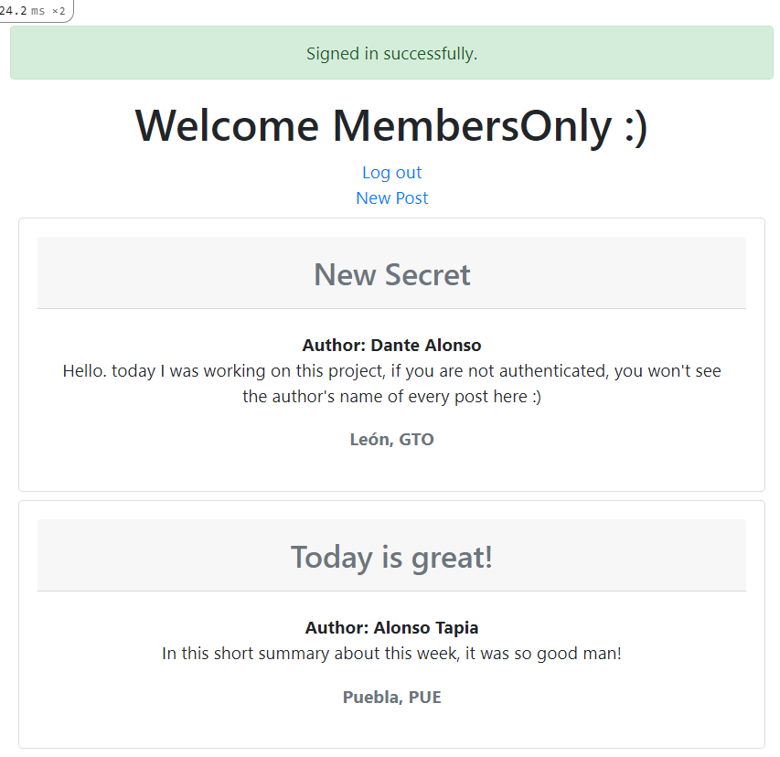
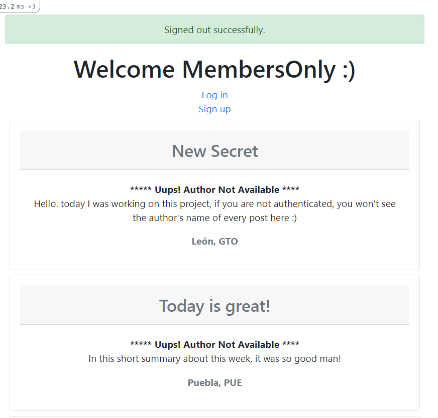
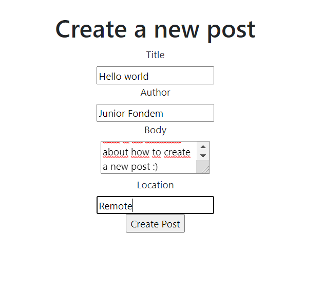

# Project: Members Only

In this project, we build an exclusive blog where members can write posts about non-members or whatever.  Inside this app, members can see who the author of a post is but, outside, they can only see the story and wonder who wrote it. You can get the full project description [here](https://www.theodinproject.com/courses/ruby-on-rails/lessons/authentication).

This project uses devise gem to create the authentication in Ruby on Rails, you can learn more about it in this project, how to use it and how to make relations in the database with the Users table created by the gem devise. We encourage you to use it because it's the easiest way to make a complete authentication, and you can customize it if you want to do it.

## Screenshots

## Built with

- Ruby on Rails
- Visual Studio Code
- Git
- GitHub

## Linters

- Rubocop
- Stylelint

## Getting Started

Follow the steps below to get a local copy running:

### Install
- To run this project on the local computer, you need to install Ruby on Rails.
    - For Windows users, visit [Ruby Installer](https://rubyinstaller.org/)
    - For MacOS and Linux users, visit the [Ruby Official Site](https://www.ruby-lang.org/en/downloads/) for instructions.
- Then clone the project by typing `git@github.com:DanteAlonsoHT/members_only.git`.

### Run App
- Type `bundle install` in the root directory of the project.
- Type `rails db:create` in the root directory of the project to create the database.
- Type `rails db:migrate` in the root directory of the project to migrate the database.
- Type `rails server` in the root directory of the project.
- Open a browser, copy and paste `http://localhost:3000`

### Warning

If you have an error named: 

**"Webpacker::Manifest::MissingEntryError in ..."**

Type in the terminal `rails webpacker:install` in the root directory of the project to fix it.

## Authors

👤 **Fondem Junior**

- [Github](https://github.com/Fondem-Jr)
- [Linkedin](https://www.linkedin.com/in/fondem-junior-57484744/)
- [Twitter](https://twitter.com/OpportunistZeus)

👤 **Dante Alonso**

- GitHub: [@DanteAlonsoHT](https://github.com/DanteAlonsoHT)
- Twitter: [@dante_dante1](https://twitter.com/dante_dante1)
- LinkedIn: [Dante Alonso](https://www.linkedin.com/in/dante-hernandez99/)

## 🤝 Contributing

Contributions, issues, and feature requests are welcome!

Feel free to check the [issues page](https://github.com/DanteAlonsoHT/members_only/issues).

## Show your support

Give a ⭐️ if you like this project!

## Acknowledgments

- [Microverse](https://www.microverse.org/)
- [The Odin Project](https://www.theodinproject.com/courses/ruby-on-rails/lessons/authentication)

## 📝 License

This project is [MIT](https://opensource.org/licenses/MIT) licensed.

